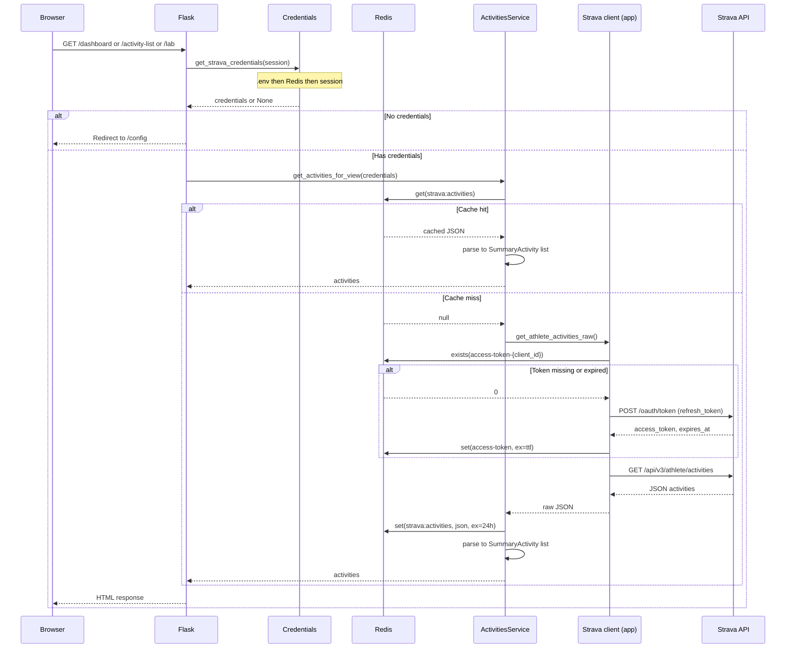

# Strava Viewer

App that fetches information from Strava and shows it in a simple Flask application.

## Note

Redis is used to store the Strava access token with an expiration time. You can change this to store it in memory during app run if you want to test without Redis.

## Data flow

The following sequence diagram shows how a request for activity data flows from the browser through auth, credentials, cache, and the Strava API.



- **Credentials** are resolved in order: `.env` → Redis (`strava:credentials`) → Flask session. Saving on `/config` writes to Redis and session.
- **Access token**: Strava API calls use a short-lived token. The app stores it in Redis key `access-token-{client_id}` and refreshes it via Strava OAuth when missing or after 401.
- **Activities cache**: Raw activity JSON is cached under `strava:activities` (and `strava:activities:club:{id}` for club feeds) with a 24-hour TTL. Settings has a “Clear cached activities” option to force a fresh fetch.

## Setup

### Strava API

You need Strava API credentials from [developers.strava.com](https://developers.strava.com/).

**Required scope:** This app needs **`activity:read`** (or **`activity:read_all`** for "Only me" activities). The default `read` scope only allows profile data and will cause `activity:read_permission missing` when loading activities.

Set the following environment variables:

```shell
STRAVA_API_CLIENT_ID=<your client id>
STRAVA_API_CLIENT_SECRET=<your client secret>
STRAVA_API_REFRESH_TOKEN=<your refresh token>

# Optional: for local dev (docker-compose sets this for Docker)
REDIS_URL=redis://localhost:6379

# Optional: Flask server port (default: 5000)
FLASK_PORT=5000
```

For local development, use [python-dotenv](https://github.com/theskumar/python-dotenv): create a `.env` file in the project root (see `.env.example`).

### Security and production

- **FLASK_SECRET_KEY** — Required when not in debug mode. The app will not start in production without a strong secret. Use a long random value (e.g. `openssl rand -hex 32`). Set **FLASK_DEBUG=true** only for local development.
- **FLASK_DEBUG** — Default is false. Enable only for local development; disable in production to avoid exposing stack traces.
- **PREFER_HTTPS** — Set to `true` when the app is served over HTTPS so session cookies are marked `Secure`.
- **CONFIG_EDIT_PASSWORD** — Optional. If set, anyone who wants to save or clear Strava credentials on the `/config` page must enter this password. Use this to restrict who can change connection settings.
- **Redis** — In production, use a password-protected Redis URL (e.g. `redis://:password@host:6379`) and restrict network access to Redis. Optionally set **REDIS_CREDENTIALS_TTL** (seconds) so credentials stored from the config form expire after a period.
- **Rate limiting** — The app applies rate limits to `/config` and to activity/dashboard/lab routes. Set **RATE_LIMIT_STORAGE_URI** (e.g. to your Redis URL) for persistent limits across processes; otherwise limits are in-memory. Limits can be tuned with **RATE_LIMIT_DEFAULT**, **RATE_LIMIT_CONFIG**, and **RATE_LIMIT_API** (see `.env.example`).

#### Getting a refresh token with activity access

The "Your Access Token" on the Strava app page is short-lived and may only have `read` scope. To get a **refresh token** that includes `activity:read`:

1. In [My API Application](https://www.strava.com/settings/api), set **Authorization Callback Domain** (e.g. `localhost` for local testing).

2. Open this URL in your browser (replace `YOUR_CLIENT_ID` and `YOUR_REDIRECT_URI`; the redirect URI must match exactly what is configured in your app, e.g. `http://localhost` or `http://localhost:5000/callback`):

   ```
   https://www.strava.com/oauth/authorize?client_id=YOUR_CLIENT_ID&redirect_uri=YOUR_REDIRECT_URI&response_type=code&scope=read,activity:read_all&approval_prompt=force
   ```

   Use `activity:read` instead of `activity:read_all` if you only need activities visible to Everyone/Followers.

3. After you authorize, Strava redirects to `YOUR_REDIRECT_URI?code=...`. Copy the `code` from the URL (use the full URL if the page fails to load).

4. Exchange the code for tokens:

   ```shell
   curl -X POST https://www.strava.com/oauth/token \
     -d client_id=YOUR_CLIENT_ID \
     -d client_secret=YOUR_CLIENT_SECRET \
     -d code=THE_CODE_FROM_STEP_3 \
     -d grant_type=authorization_code
   ```

5. From the JSON response, put **`refresh_token`** into `.env` as `STRAVA_API_REFRESH_TOKEN`. The app will use it to obtain short-lived access tokens with the correct scope.

## Running the app

### Docker

For production use with Docker, provide a real `.env` file with your secrets (docker-compose uses `.env.example` by default, which only has placeholders).

```bash
docker-compose up
```

or:

```bash
make up
```

### Local development

Install [uv](https://docs.astral.sh/uv/), then:

**Install dependencies**

```shell
uv sync --all-extras
```

**Run the app**

For local runs, set `FLASK_DEBUG=true` in `.env` so `FLASK_SECRET_KEY` is not required.

```shell
uv run python strava_viewer/flask_server/main.py
```

or:

```shell
make flask_start
```

**Run tests**

```shell
uv run pytest
```

or:

```shell
make test
```
